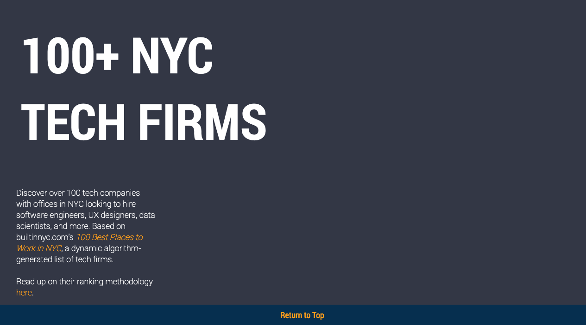

# Summary

Built with [tabulator.js] (http://tabulator.info/), this is a static responsive table listing over 100 NYC tech companies employing software engineers, UX designers, data scientists, and more.

Data is comes from builtinnyc.com's [100 Best Places to Work in NYC](https://www.builtinnyc.com/companies/best-places-to-work-nyc), a dynamic algorithm-generated list of tech firms.

